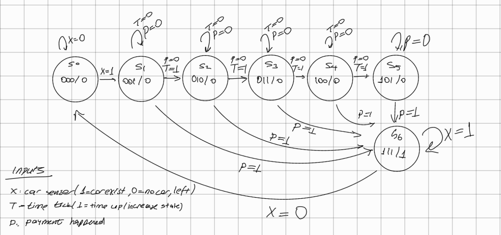
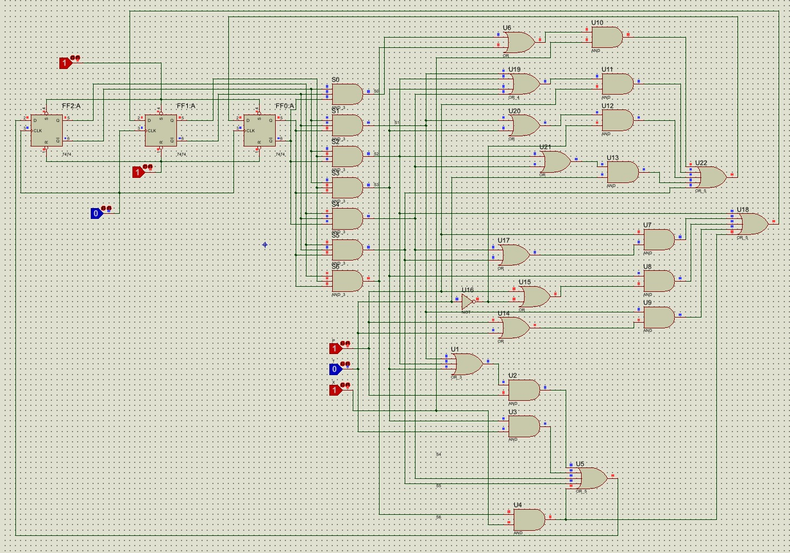
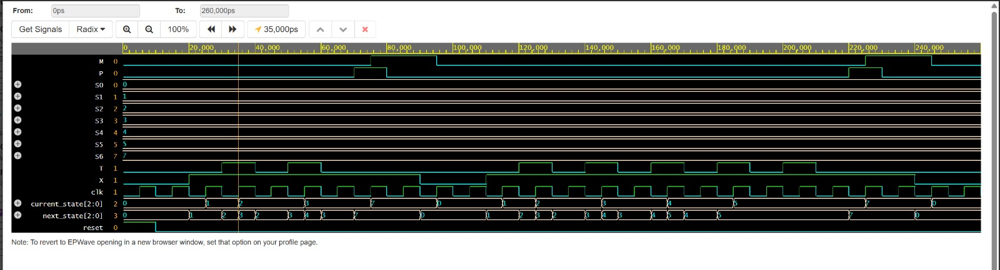

# 🚗 Smart Parking Tariff and Gate Control System

## 📌 Project Overview
This project involves the design and implementation of a synchronous **Moore Finite State Machine (FSM)** for an automated parking system. The system tracks the duration of a parked vehicle, calculates increasing tariff levels based on time ticks, and automatically triggers the exit gate motor upon successful payment.

Unlike standard FSM designs, this system incorporates **6 variables** (3 state bits and 3 inputs), making traditional Karnaugh Maps impractical. Therefore, the hardware logic was derived and minimized entirely through **algebraic synthesis (Boolean Algebra)**.

## ⚙️ System Architecture & State Design
The system transitions between 7 distinct states (S0 to S6) representing an empty lot, various tariff levels, and the gate opening sequence. 

*   **Inputs:** `X` (Car Sensor), `P` (Payment Confirmation), `T` (Time Tick)
*   **Outputs:** `M` (Gate Motor)
*   **Memory Elements:** 3x D-Type Flip-Flops (Q2, Q1, Q0)

*(My hand-drawn state diagram visualizing the tariff increments and payment transitions)*
 

## 🛠️ Hardware Implementation (Proteus)
The algebraically minimized Boolean equations were implemented at the gate level using **7474 D-Type Flip-Flops** and basic logic gates (AND, OR, NOT) in the Proteus Design Suite. A custom state decoder was built to optimize the combinational logic routing and prevent wire clutter.

*(Hardware simulation showing successful logic routing and state transitions)*
 

## 💻 Verilog HDL & Behavioral Simulation
To ensure absolute zero-defect logic before physical implementation, the Moore FSM was modeled using a behavioral Verilog HDL structure. A comprehensive testbench was designed to simulate worst-case scenarios, including max-tariff holding and asynchronous car departures.

*(Waveform analysis demonstrating synchronized state progression and motor activation only at state S6)*
 

## 📂 Project Structure
*   `/src`: Contains the Verilog source code (`parking_system.v`) and Testbench (`tb_parking_systtem.v`).
*   `/docs`: Includes the detailed academic experiment report defining learning outputs and procedure.
*   `/images`: Schematic captures, waveform results, and state diagrams.
